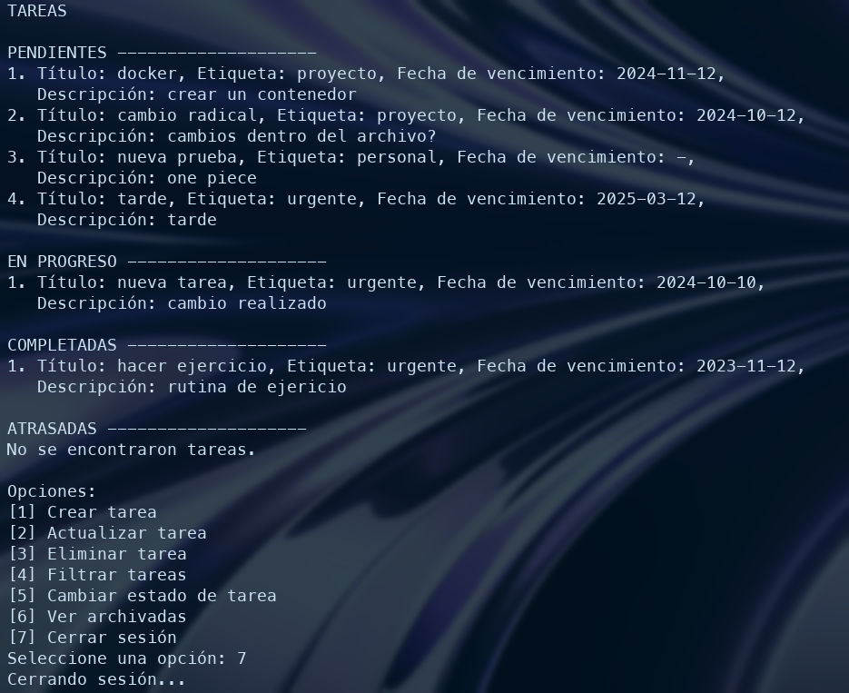

# Tarea1-MyTask

## Descripción
Implementación de una aplicación monolítica para la gestión de tareas a través de la consola. La aplicación permite crear, borrar, editar y actualizar tareas, funcionando como una lista de tareas (TO-DO list).

- Puede obtener más información sobre el proceso de trabajo en el documento PDF adjunto. [Haga clic aquí](https://github.com/Equipo13-PruebadeSoftware/Tarea1-MyTask/blob/main/DocumentoEquipo13.pdf)




## Instalación
1. Clona el repositorio:
```
git clone https://github.com/Equipo13-PruebadeSoftware/Tarea1-MyTask.git
```

### Opción Docker
1. Construir imagen Docker:
```
docker build -t nombre_del_contenedor .
```
2. Ejecuta el contenedor con el volumen montado:
```
docker run -v $(pwd)/Tarea1-MyTask/data:/app/data -v $(pwd)/Tarea1-MyTask/logs:/app/logs -it nombre_del_contenedor
```
Esto es para que los cambios sean almacenados dentro de la carpeta data y logs, de esta forma guardar los cambios a nivel local.
`$(pdw)` debe ser reemplazado por la direccion a la carpeta /Tarea1-MyTask/data y /Tarea1-MyTask/logs donde los has clonado.

### Opción Terminal
1. Instalar dependecias para bcrypt:
```
python3 -m pip install bcrypt
```

Con esto puede verificar que quedo correctamente instalado:
```
python3 -m pip show bcrypt
```
2. Ejecutar programa en consola:
```
python3 Tarea1-MyTask/src/main.py
```
Si ya estas en el directorio Tarea1-MyTask, omite esto y solo utiliza `src/main.py`

## Cómo usar
Una vez ejecutada la aplicación, se desplegará un menú en la consola similar al siguiente:

%2011.46.11 p. m..png)

Si no tienes un usuario registrado, regístrate primero y luego inicia sesión. Si ya tienes un usuario, inicia sesión directamente. Una vez autenticado, podrás acceder a todas las opciones disponibles.

%2011.47.44 p. m..png)

## Autores
Equipo 13
- Pablo campos
- Luis Zegarra

## Cómo contribuir
Este proyecto es parte de una tarea universitaria, por lo que no se aceptan contribuciones externas. Sin embargo, puedes utilizarlo y modificarlo a tu gusto.
